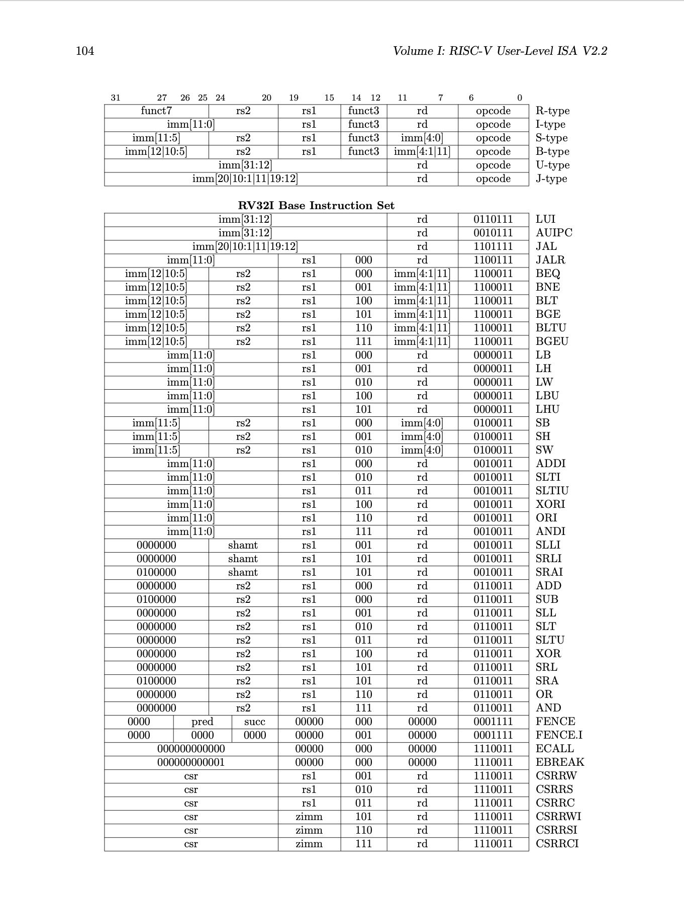

# riscv-core
A small RISC-V core in ~~Python~~ Rust (and Verilog, soon).

**UPDATE: The Python version is done, I am just porting over to Rust.**

# Prerequisite
RISC-V test suite: https://github.com/riscv-software-src/riscv-tests. It has `ELF` and `.dump` files. Use the `ELF` for the CPU and `.dump` for debug.

Not sure if this is correct or not, cause I did not see it document anywhere, but test outcome depends on the ECALL:
- ECALL with register[3] == 1 means then pass
- ECALL with register[3] > 1 means then fail

At least for the bulk of `rv32ui-p` tests.

# Notes
Some images and notes from the The RISC-V Instruction Set Manual for quick references.

## RISC-V 32I Base instruction format
32I decode scheme. All immediate need to be sign_ext to 32 bit.

32I binary instruction set

# TODO
- ~~Write a 32-bit core in Python~~
- Write a 32-bit core in Rust
- Instruction pipelining
- Port over to Verilog
- Syn on FPGA?
- ???
- Profit
