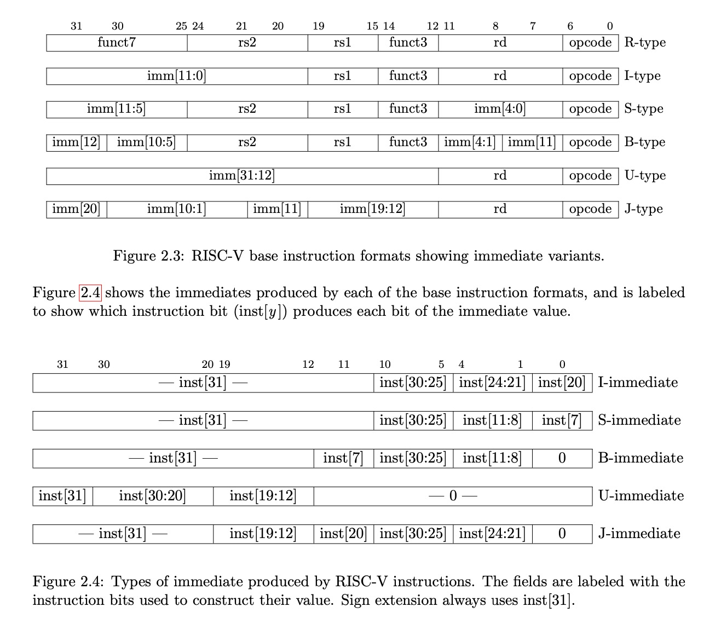

# riscv-core
A small RISC-V core in ~~Python~~ Rust (and Verilog, soon).

**UPDATE: The Python version is done, I am just porting to over to Rust first.**

# Prerequisite
RISC-V test suite: https://github.com/riscv-software-src/riscv-tests

# Notes
RISC-V instruction format



# Run test
```
export PYTHONPATH=$(pwd)
pytest
```

## Overall goals (TODO)
- ~~Write a 32-bit core in Python~~
- Write a 32-bit core in Rust
- Instruction pipelining
- Port over to Verilog
- Syn on FPGA?
- ???
- Profit
